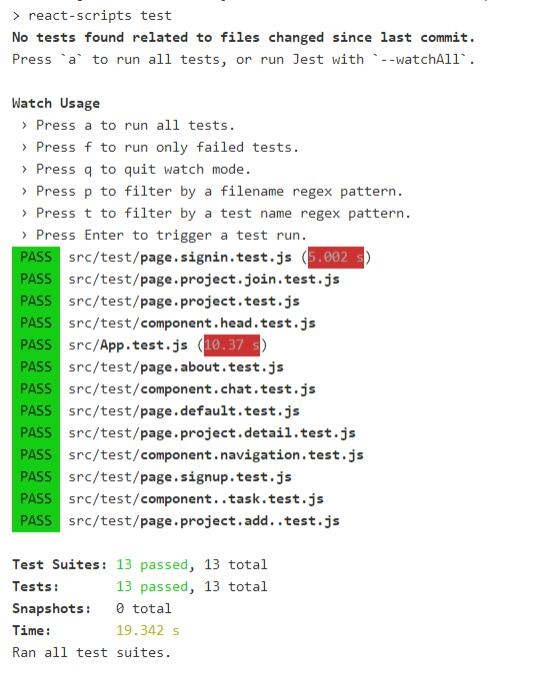
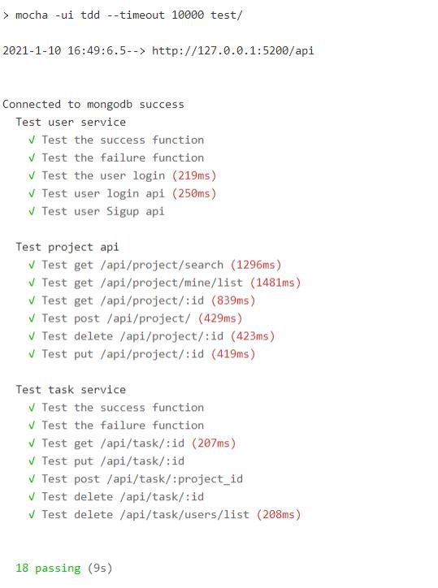

# Backend
sss
## install project dependencies

```
cd server
npm install
or yarn install
```

## run project

```
cd server
npm run start
or yarn start
```

> terminal console http://127.0.0.1:5100/api and Connected to mongodb success, backend run success

# Fronend

## install project dependencies

```
cd client
npm install
or yarn install
```

## run project

```
cd client
npm run start
or yarn start
```

> terminal console Local: http://localhost:3000 , fronend run success

### Pack Project

```
cd client
npm run build
or yarn build
```

## Project directory structure


```
.
|-- client        ------------------------React frontend directory
|   |-- package.json ---------------------package manage
|   |-- public----------------------------static resource
|   |   |-- favicon.ico
|   |   |-- index.html
|   |   |-- logo192.png
|   |   |-- logo512.png
|   |   |-- manifest.json
|   |   `-- robots.txt
|   |-- README.md
|   `-- src-------------------------------react code directory
|       |-- actions-----------------------react state manger action directory
|       |   `-- index.js------------------action function
|       |-- App.css-----------------------app.js style
|       |-- App.js
|       |-- App.test.js
|       |-- common------------------------common function directory
|       |   |-- Httphelper.js-------------processing api requests class
|       |   |-- SockerClient.js-----------processing websocket
|       |   `-- Utility.js----------------comment method
|       |-- components--------------------react components directory
|       |   |-- component.chat.js---------webstocket chat component
|       |   |-- component.header.js-------webstie header component
|       |   |-- component.module.scss-----componet style
|       |   |-- component.page.navigation.js ---turn the page component
|       |   `-- component.task.js---------task component
|       |-- index.css---------------------index.js style
|       |-- index.js----------------------react entery file
|       |-- logo.svg
|       |-- pages-------------------------website page
|       |   |-- page.about.js-------------about page
|       |   |-- page.base.js
|       |   |-- page.default.js-----------my project page
|       |   |-- page.login.js-------------user login page
|       |   |-- page.project.add.js-------add project plan page
|       |   |-- page.project.detail.js----project detail page
|       |   |-- page.project.join.js------my join project page
|       |   |-- page.signup.js------------user signup page
|       |   `-- pages.module.scss---------page style
|       |-- reducers----------------------react state manager reduice directory
|       |   |-- index.js------------------reducer manager
|       |   |-- reducer.project.js--------project state
|       |   |-- reducer.task.js-----------task state
|       |   `-- reducer.user.js-----------user state
|       |-- reportWebVitals.js
|       |-- setupTests.js
|       `-- test-------------------------------react test directory
|           |-- component.chat.test.js
|           |-- component.head.test.js
|           |-- component.navigation.test.js
|           |-- component..task.test.js
|           |-- page.about.test.js
|           |-- page.default.test.js
|           |-- page.project.add..test.js
|           |-- page.project.detail.test.js
|           |-- page.project.join.test.js
|           |-- page.project.test.js
|           |-- page.signin.test.js
|           `-- page.signup.test.js
|-- doc
|   |-- ProjectManager.uml         UML design diagram
|   |-- UI\ design.rp              UI design diagram
|-- readme.md
`-- server------------------------------backend direcotry
    |-- index.js------------------------backend enter file
    |-- package.json--------------------package manager
    |-- pm2.json------------------------node js pm2 config 
    |-- src-----------------------------project code
    |   |-- api-------------------------processing fronend request
    |   |   |-- api.index.js
    |   |   |-- api.project.js
    |   |   |-- api.task.js
    |   |   `-- api.user.js
    |   |-- config.js-------------------database connection
    |   |-- main.js---------------------project start 
    |   |-- model-----------------------project mongodb table structure
    |   |   |-- model.message.js
    |   |   |-- model.project.js
    |   |   |-- model.task.js
    |   |   `-- model.user.js
    |   `-- service---------------------logic processing
    |       |-- BaseService.js----------operator monogdb class
    |       |-- ProjectService.js-------project project CURD
    |       |-- SocketService.js--------processing socket logic
    |       |-- TaskService.js----------task CURD
    |       `-- UserService.js----------user signup and signin
    `-- test----------------------------backend test directory
        `-- api.test.js
```


## test

### fronend test
```
cd client
npm run test
```
The test results are shown in the figure below


### backend test
```
cd server
npm run test
```
The test results are shown in the figure below

